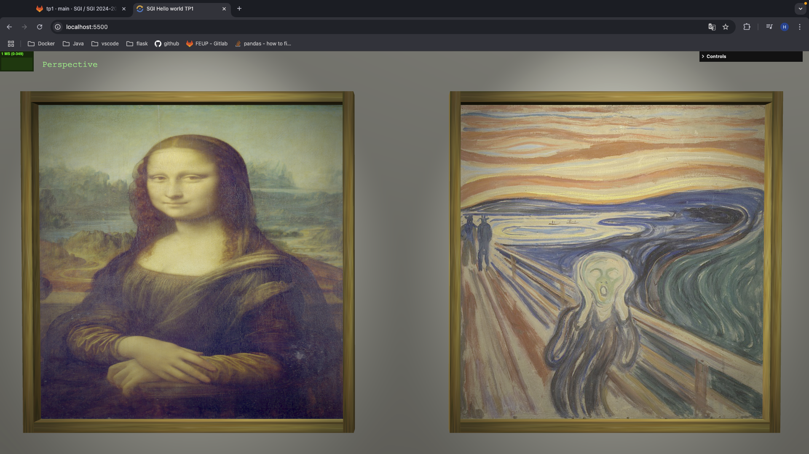
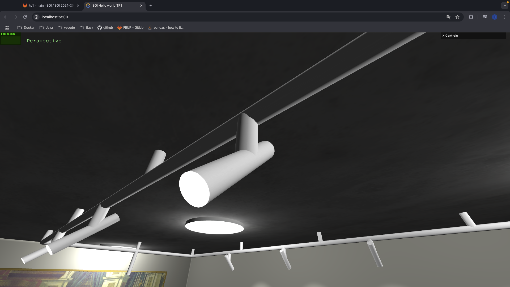
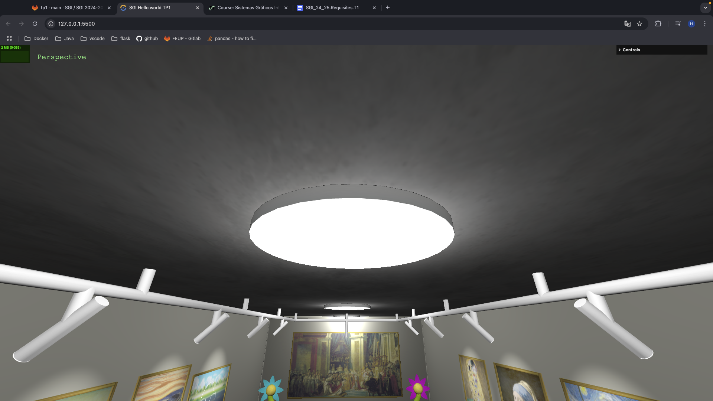
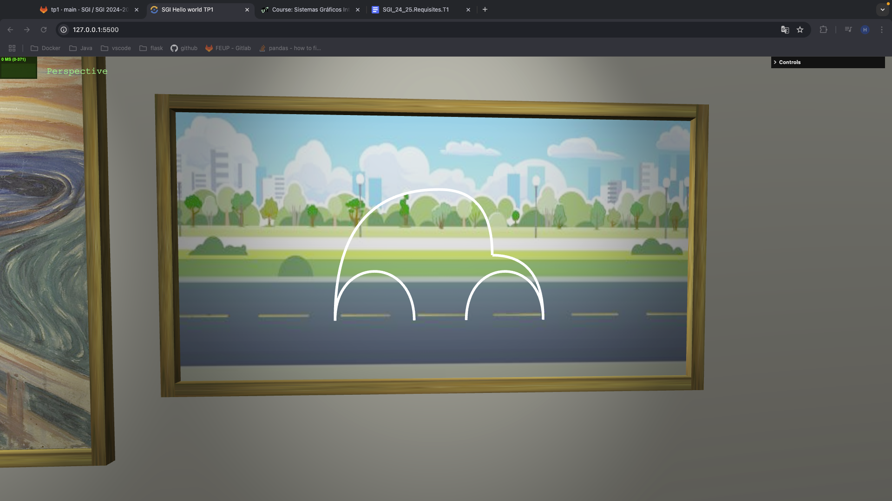
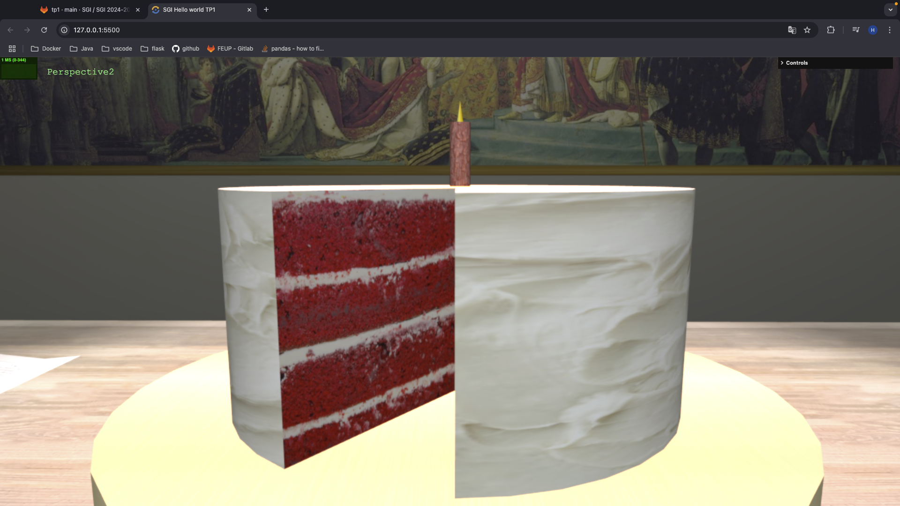
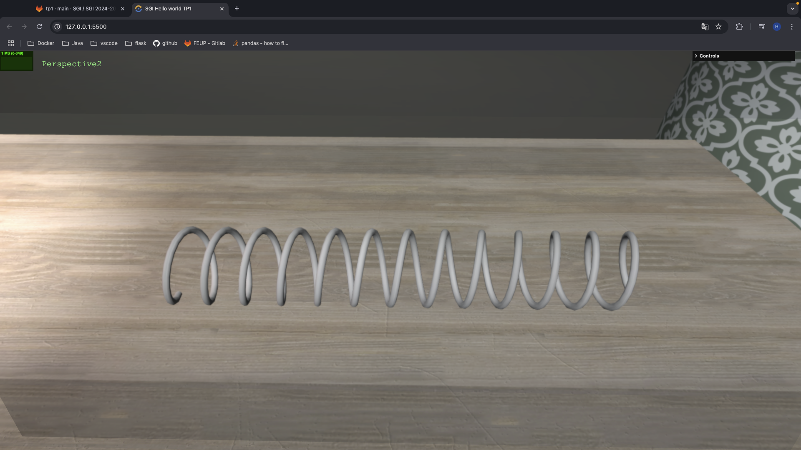
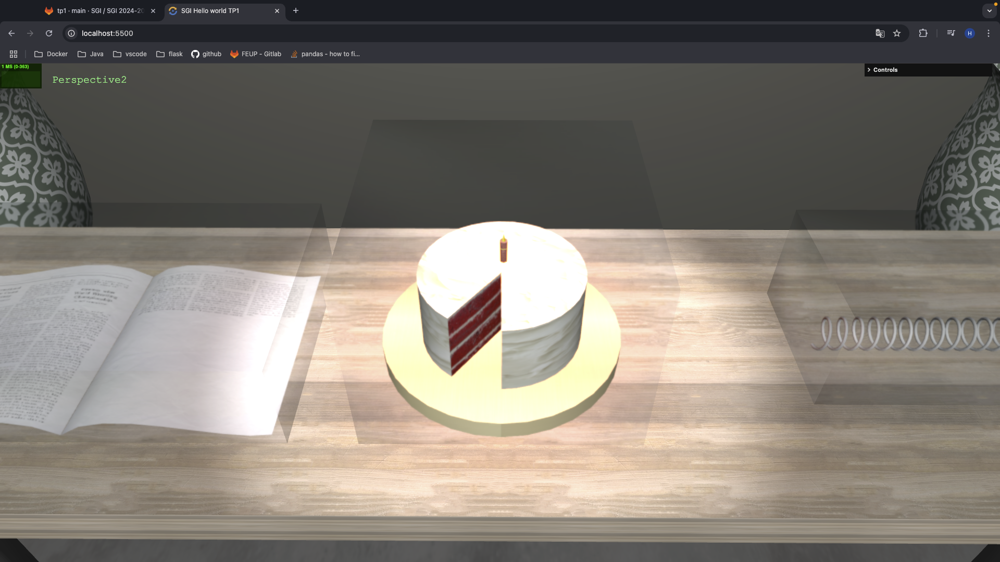
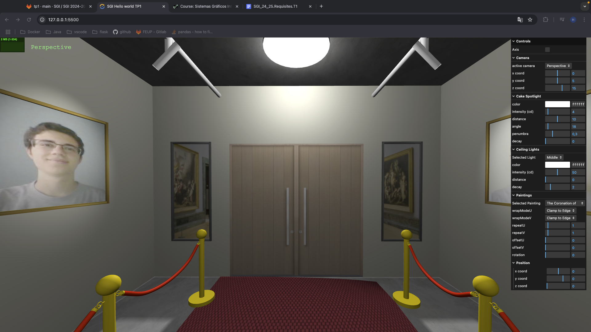

# SGI 2024/2025 - TP1

## Group: T04G05

| Name             | Number    | E-Mail             |
| ---------------- | --------- | ------------------ |
| Henrique Silva   | 202105647 | up202105647@up.pt  |
| Tomás Gaspar     | 202108828 | up202108828@up.pt  |

----
## Project information

In this project we decided to create a museum room with the information we learnt from the TP classes.

### Painting

A painting can be decomposed in two objects, a frame and the painting itself. To build the frame, we used four `BoxGeometry` while the painting is a `PlaneGeometry`. A texture is then applied to the `PlaneGeometry` to simmulate the painting.

    
    
Figure 1: Paintings

### Painting Spotlight

Each painting has a spotlight dedicated to illuminate it.
These lights are composed by four elements: a connection to the Painting Light's Support, the object representing the spotlight, an object representing the light comming out of the spotlight and the spotlight itself. A `CylinderGeometry` was used to build the first three elements. A texture was applied to the third object that matches the color of the light comming out of the spotlight. When we change the color of the spotlight, the color of the texture also changes.

    
    
Figure 2: Painting Spotlight

### Painting Spotlight's Support

To connect the painting's spotlight to the ceiling, a support was created. To make the structure format, `LineCurve3` were utilized to make the straight lines and `QuadraticBezierCurve3` to make the curved lines.

    
    
Figure 3: Painting Spotlight's Support

### Room illumination

To illuminate the room we decided to create three pointlights. To represent these objects we used a `CylinderGeomtry`. To simulate the light comming out of the object, we applied a texture to the bottom of the cylinder were the color and the emissive values match the color of the light emitted from pointlight. 

    
    
Figure 4: Room illumination

### Beetle

The beetle was created using curves. `QuadraticBezierCurve3` were used to make the quarter circunferences and `CubicBezierCurve3` were used to make the half circunferences.

    
    
Figure 5: Beetle

### Cake, Candle and Flame

A `CylinderGeometry` was used to make the cake. To fill the inside of the cake where the slice is missing, two `PlaneGeometry` objects were used.

To make the candle, a `CylinderGeometry` was also used.
The flame was built using a `ConeGeometry`.

    
    
Figure 6: Cake, Candle and Flame

### Spring

The format of the spring was created with a `CatmullRomCurve3`. We then used this curve to make a `TubeGeometry`.

    
    
Figure 7: Spring

### Newspaper

### GlassBox

Since this is a museum, we decided that the cake, journal and spring should be considered ancient artificats. Therefore, they should be protected from the public. To meet this requirement, a glass box was constructed. We started by making a box with `BoxGeometry` and then applied a glass texture with `roughness` to 0 so the glass is "smooth" and `transmission` to 1 to make it transparent. A `MeshPhysicalMaterial` was used to make the glass look realistic, otherwise we wouldn't be able to see through it.

    
    
Figure 9: Glass Box

### Landscape

For the landscape, we used a `PlaneGeometry` outside of the room where we applied a texture to it. This was done to simulate another room of the museum. To be able to see the room, two windows were made on the wall, where we used the glass material mentioned before on the `GlassBox` to be able to see through it.

    
    
Figure 10: Landscape

<!-- - (items describing main strong points)
- Scene
  - (Brief description of the created scene)
  - (relative link to the scene)
----
## Issues/Problems

- (items describing unimplemented features, bugs, problems, etc.) -->