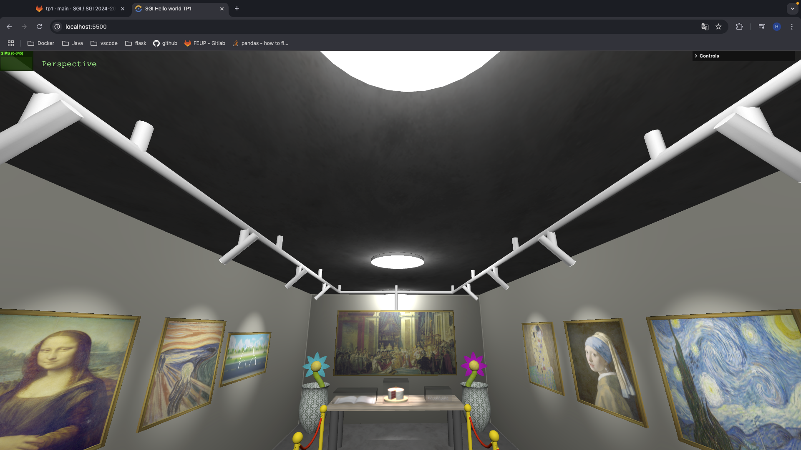

# SGI 2024/2025 - TP1

## Group: T04G05

| Name             | Number    | E-Mail             |
| ---------------- | --------- | ------------------ |
| Henrique Silva   | 202105647 | up202105647@up.pt  |
| Tomás Gaspar     | 202108828 | up202108828@up.pt  |

----
## Project information

In this project we decided to create a museum room with the information we learnt from the TP classes.

    
    
Figure 1: Scene

### Painting

A painting can be decomposed in two objects, a frame and the painting itself. To build the frame, we used four `BoxGeometry` while the painting is a `PlaneGeometry`. A texture is then applied to the `PlaneGeometry` to simmulate the painting.

    
    
Figure 2: Paintings

### Painting Spotlight

Each painting has a spotlight dedicated to illuminate it.
These lights are composed by four elements: a connection to the Painting Light's Support, the object representing the spotlight, an object representing the light comming out of the spotlight and the spotlight itself. A `CylinderGeometry` was used to build the first three elements. A texture was applied to the third object that matches the color of the light comming out of the spotlight. When we change the color of the spotlight, the color of the texture also changes.

    
    
Figure 3: Painting Spotlight

### Painting Spotlight's Support

To connect the painting's spotlight to the ceiling, a support was created. To make the structure format, `LineCurve3` were utilized to make the straight lines and `QuadraticBezierCurve3` to make the curved lines.

    
    
Figure 4: Painting Spotlight's Support

### Room illumination

To illuminate the room we decided to create three pointlights. To represent these objects we used a `CylinderGeomtry`. To simulate the light comming out of the object, we applied a texture to the bottom of the cylinder were the color and the emissive values match the color of the light emitted from pointlight. 

    
    
Figure 5: Room illumination

### Beetle

The beetle was created using curves. `QuadraticBezierCurve3` were used to make the quarter circunferences and `CubicBezierCurve3` were used to make the half circunferences.

    
    
Figure 6: Beetle

### Cake, Candle, Flame, and Plate

A `CylinderGeometry` was used to make the cake and the plate. To fill the inside of the cake where the slice is missing, two `PlaneGeometry` objects were used.

To make the candle, a `CylinderGeometry` was also used.
The flame was built using a `ConeGeometry`.

    
    
Figure 7: Cake, Candle and Flame

### Spring

The format of the spring was created with a `CatmullRomCurve3`. We then used this curve to make a `TubeGeometry`.

    
    
Figure 8: Spring

### Newspaper

The newspaper was created using a NURBS surface, which was duplicated and scaled with a factor of -1 to create the double page effect. Despite the 2 pages, a single texture was used and it was manipulated with repeat and offset to simulate the two pages.

    
    
Figure 9: Newspaper

### GlassBox

Since this is a museum, we decided that the cake, newspaper and spring should be considered ancient artificats. Therefore, they should be protected from the public. To meet this requirement, a glass box was constructed. We started by making a box with `BoxGeometry` and then applied a glass texture with `roughness` to 0 so the glass is "smooth" and `transmission` to 1 to make it transparent. A `MeshPhysicalMaterial` was used to make the glass look realistic, otherwise we wouldn't be able to see through it.

    
    
Figure 10: Glass Box

### Table

The table top was created using a `BoxGeometry` and a wooden texture was applied. As for the table legs, they were created using `CylinderGeometry`, and applied a specular material.

    
    
Figure 11: Table

### Landscape

For the landscape, we used a `PlaneGeometry` outside of the room where we applied a texture to it. This was done to simulate another room of the museum. To be able to see the room, two windows were made on the wall, where we used the glass material mentioned before on the `GlassBox` to be able to see through it.

    
    
Figure 12: Landscape

### Jar

The jar was created using NURBS surfaces. There is an inner and outer surface (slightly bigger), both of which are duplicated and mirrored to create the full jar. Inside the jar, a `CircleGeometry` was used to create a piece of dirt.

    
    
Figure 13: Jar

### Flower

The flower used a `TubeGeometry` defined by a `CatmullRomCurve3` for the stem. The receptacle is a simple `SphereGeometry`. The petals are NURBS surfaces, and are placed all around the receptacle except for the bottom as to not intercect with the stem.

    
    
Figure 14: Flower

### Carpet

The carpet was created using a NURBS surface to allow for the simulation of a curl in one of the corners. 

    
    
Figure 15: Carpet

### Barrier

Barriers are composed of two main elements: the poles and the rope. The poles were built using `CylinderGeometry`, `SphereGeometry`, and `TorusGeometry`. This last one was used to create the ring which holds the rope. The rope was created using a `TubeGeometry` and a `CatmullRomCurve3`, and also features `CylinderGeometry` and `TorusGeometry` for the attachment part.

    
    
Figure 16: Barrier

### Wall

The wall was created using a `PlaneGeometry` and a diffuse material. Walls can receive an optional parameter to create a hole of a given size and position (can be seen in [Figure 12](#landscape)).

### User Interface

The developed user interface allows for control of every light in the room, i.e. the ceiling lights, the cake spotlight, and the painting spotlights.

It is possible to enable and disable axis visibility, as well as to choose different cameras and change their position.

Finally there are several options to change the texture parameters of every painting, as well as the position of the paintings along their respective walls.

    
    
Figure 17: User Interface

## Issues/Problems

- We managed to overcome every issue we encountered during the development of this project, and implemented all the features we wanted to include.