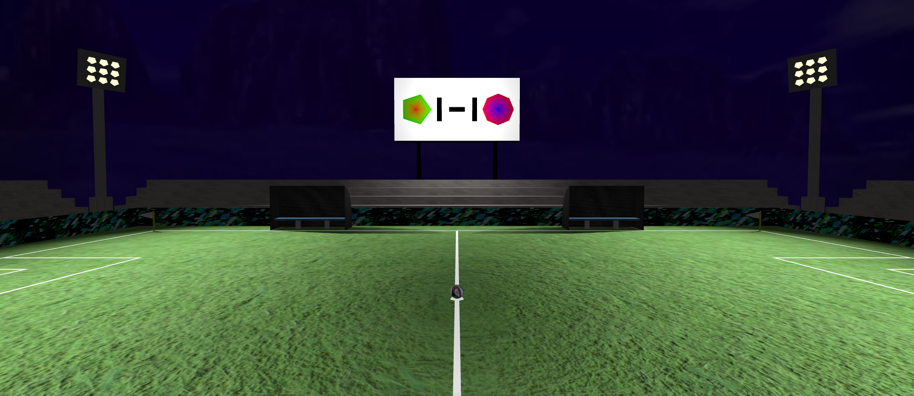
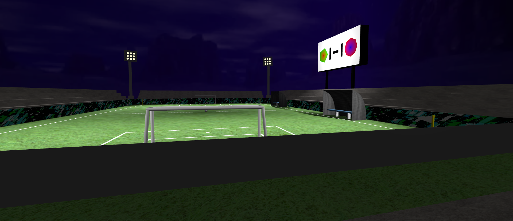

# SGI 2024/2025 - TP2

## Group: T04G05

| Name             | Number    | E-Mail             |
| ---------------- | --------- | ------------------ |
| Henrique Silva   | 202105647 | up202105647@up.pt  |
| Tomás Gaspar     | 202108828 | up202108828@up.pt  |

----
## Project information

The scene is a football stadium which contains a pitch with lines delimiting its perimeter and the penalty area, goals, corner flags, and a ball. Around the pitch there are some spectator stands and a working light in each corner. Finally there are two substitute benches and a score board.
Bellow are two pictures which illustrate the developed scene.

