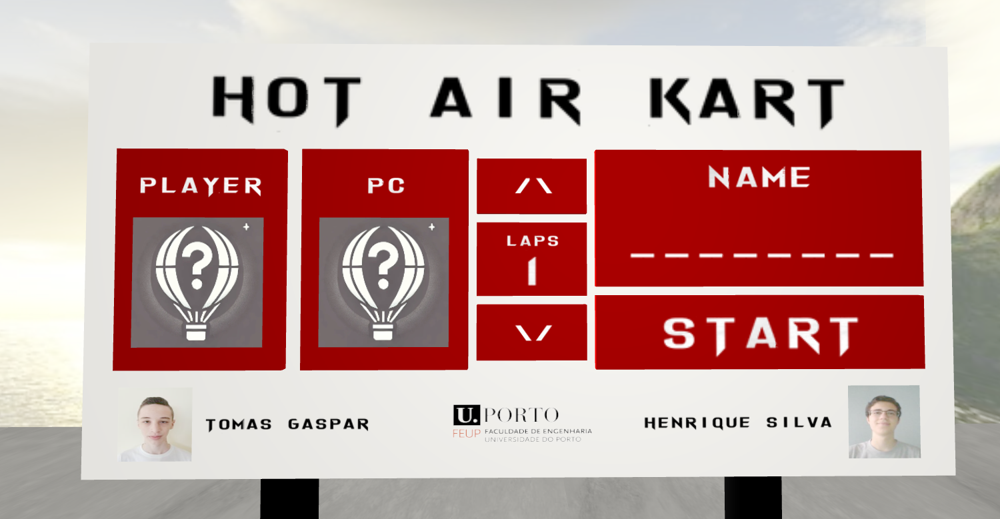
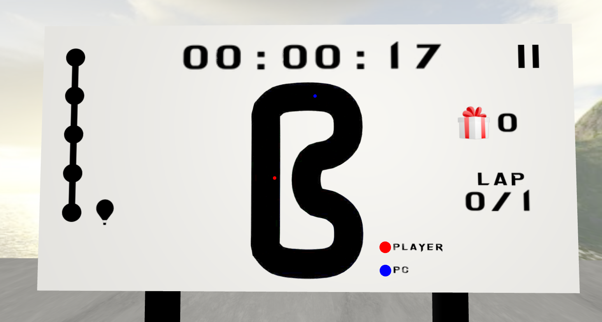
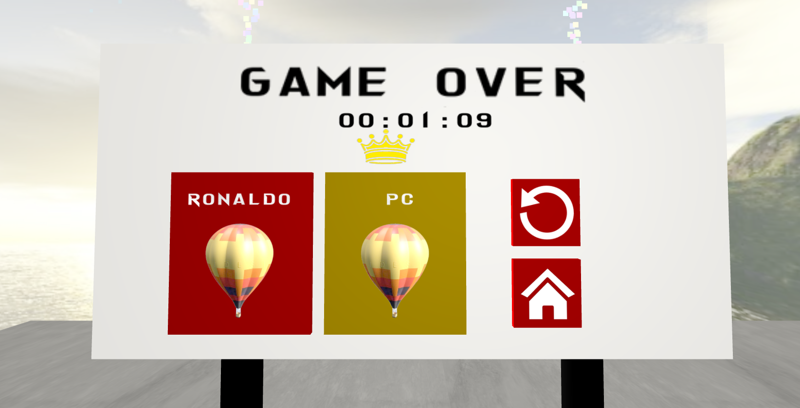
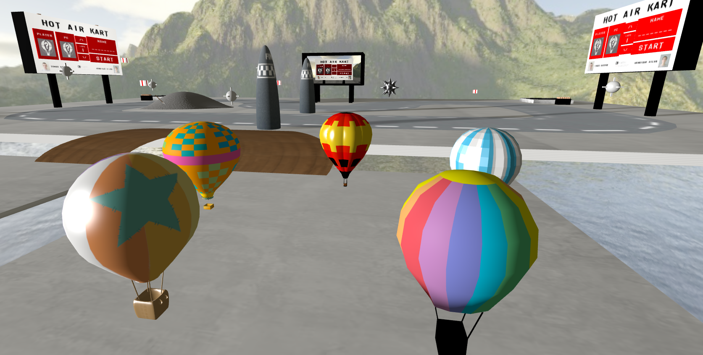

# SGI 2024/2025 - TP3

## Group: T04G05

### Grade: 19.1

| Name             | Number    | E-Mail             |
| ---------------- | --------- | ------------------ |
| Henrique Silva   | 202105647 | up202105647@up.pt  |
| Tomás Gaspar     | 202108828 | up202108828@up.pt  |

----
## Project information

This project consists of a hot air balloon race game. The player controls a hot air balloon and must avoid obstacles while collecting vouchers.

Main menu

Game display

End menu

Scene overview
